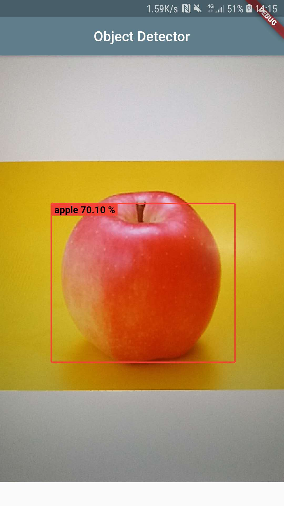

# Real-time Object Detector

这是一款基于[Paddle-Lite](https://github.com/paddlepaddle/paddle-lite)的实时目标检测App，使用Flutter开发，模型默认支持的是YOLO v3。

## 开发环境

- OS: Ubuntu
- Flutter version 1.22.5
- Dart version 2.10.4
- Paddle Lite预编译库 2.6.1
- armv8测试通过

## 介绍及截图

模型下载地址： https://pan.baidu.com/s/1lO1HWiD-AZC_bXx92RqhmA 提取码: jgmd 

请将模型放至`android/app/src/main/assets/models/fruit`路径下。

详细介绍位置：[基于Paddle-Lite的实时目标检测程序(Flutter & YOLO v3)](https://oldblog.lirui.tech/2020/%E5%9F%BA%E4%BA%8Epaddle-lite%E7%9A%84%E5%AE%9E%E6%97%B6%E7%9B%AE%E6%A0%87%E6%A3%80%E6%B5%8B%E7%A8%8B%E5%BA%8F-flutter-yolo-v3/) 及 [使用飞桨框架部署SSD目标检测模型](https://oldblog.lirui.tech/2020/%E4%BD%BF%E7%94%A8%E9%A3%9E%E6%A1%A8%E6%A1%86%E6%9E%B6%E9%83%A8%E7%BD%B2ssd%E7%9B%AE%E6%A0%87%E6%A3%80%E6%B5%8B%E6%A8%A1%E5%9E%8B/)

English tutorial:  [Real-time Object Detection on Android using Paddle-Lite](https://oldblog.lirui.tech/2020/real-time-object-detection-on-android-using-paddle-lite/)

Demo截图：

